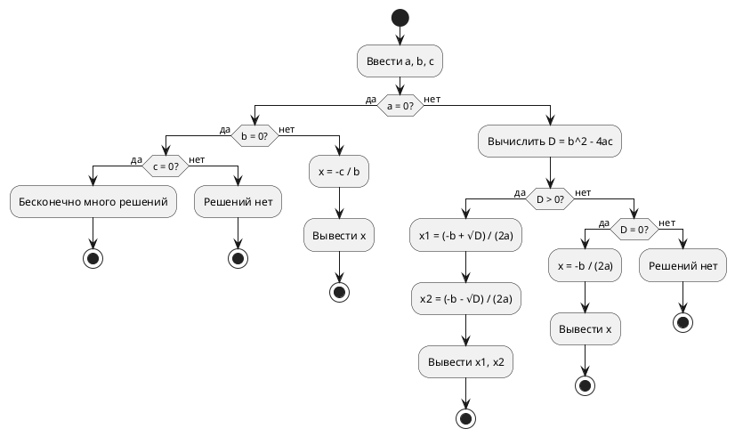

```plantuml
@startuml
start

:Ввести a, b, c;

if (a = 0?) then (да)
  if (b = 0?) then (да)
    if (c = 0?) then (да)
      :Бесконечно много решений;
      stop
    else (нет)
      :Решений нет;
      stop
    endif
  else (нет)
    :x = -c / b;
    :Вывести x;
    stop
  endif
else (нет)
  :Вычислить D = b^2 - 4ac;
  if (D > 0?) then (да)
    :x1 = (-b + √D) / (2a);
    :x2 = (-b - √D) / (2a);
    :Вывести x1, x2;
    stop
  else (нет)
    if (D = 0?) then (да)
      :x = -b / (2a);
      :Вывести x;
      stop
    else (нет)
      :Решений нет;
      stop
    endif
  endif
endif

@enduml
```
