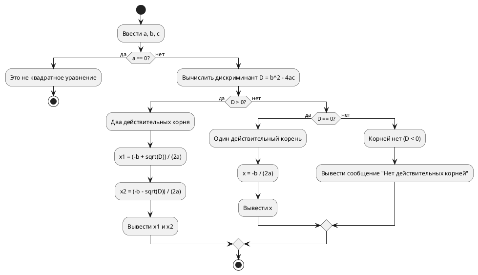

```plantuml
@startuml
start

:Ввести a, b, c;
if (a == 0?) then (да)
  :Это не квадратное уравнение;
  stop
else (нет)
  :Вычислить дискриминант D = b^2 - 4ac;
  if (D > 0?) then (да)
    :Два действительных корня;
    :x1 = (-b + sqrt(D)) / (2a);
    :x2 = (-b - sqrt(D)) / (2a);
    :Вывести x1 и x2;
  else (нет)
    if (D == 0?) then (да)
      :Один действительный корень;
      :x = -b / (2a);
      :Вывести x;
    else (нет)
      :Корней нет (D < 0);
      :Вывести сообщение "Нет действительных корней";
    endif
  endif
  stop
endif

@enduml
```
