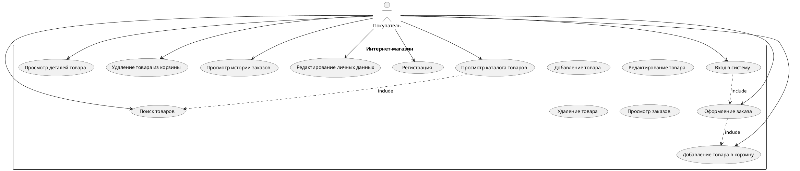

```plantuml-svg
@startuml

actor Покупатель
actor Менеджер
actor Администратор

rectangle "Интернет-магазин" {
    usecase (Регистрация) as UC1
    usecase (Вход в систему) as UC2
    usecase (Просмотр каталога товаров) as UC3
    usecase (Поиск товаров) as UC4
    usecase (Просмотр деталей товара) as UC5
    usecase (Добавление товара в корзину) as UC6
    usecase (Удаление товара из корзины) as UC7
    usecase (Оформление заказа) as UC8
    usecase (Просмотр истории заказов) as UC9
    usecase (Редактирование личных данных) as UC10
    usecase (Добавление товара) as UC11
    usecase (Редактирование товара) as UC12
    usecase (Удаление товара) as UC13
    usecase (Просмотр заказов) as UC14
    usecase (Обновление статуса заказа) as UC15
    usecase (Просмотр списка пользователей) as UC16
    usecase (Добавление пользователя) as UC17
    usecase (Редактирование пользователя) as UC18
    usecase (Удаление пользователя) as UC19
    usecase (Назначение роли пользователю) as UC20
    usecase (Управление заказами) as UC21
    usecase (Настройка системы) as UC22

    Покупатель --> UC1
    Покупатель --> UC2
    Покупатель --> UC3
    Покупатель --> UC4
    Покупатель --> UC5
    Покупатель --> UC6
    Покупатель --> UC7
    Покупатель --> UC8
    Покупатель --> UC9
    Покупатель --> UC10

    Менеджер --> UC2
    Менеджер --> UC11
    Менеджер --> UC12
    Менеджер --> UC13
    Менеджер --> UC14
    Менеджер --> UC15
    Менеджер --> UC16

    Администратор --> UC2
    Администратор --> UC17
    Администратор --> UC18
    Администратор --> UC19
    Администратор --> UC20
    Администратор --> UC21
    Администратор --> UC22

    UC2 ..> UC8 : include
    UC3 ..> UC4 : include
    UC8 ..> UC6 : include
    UC21 ..> UC15 : extend
}

@enduml
```

```plantuml
@startuml

actor Покупатель

rectangle "Интернет-магазин" {
    usecase (Регистрация) as UC1
    usecase (Вход в систему) as UC2
    usecase (Просмотр каталога товаров) as UC3
    usecase (Поиск товаров) as UC4
    usecase (Просмотр деталей товара) as UC5
    usecase (Добавление товара в корзину) as UC6
    usecase (Удаление товара из корзины) as UC7
    usecase (Оформление заказа) as UC8
    usecase (Просмотр истории заказов) as UC9
    usecase (Редактирование личных данных) as UC10
    usecase (Добавление товара) as UC11
    usecase (Редактирование товара) as UC12
    usecase (Удаление товара) as UC13
    usecase (Просмотр заказов) as UC14

    Покупатель --> UC1
    Покупатель --> UC2
    Покупатель --> UC3
    Покупатель --> UC4
    Покупатель --> UC5
    Покупатель --> UC6
    Покупатель --> UC7
    Покупатель --> UC8
    Покупатель --> UC9
    Покупатель --> UC10


    UC2 ..> UC8 : include
    UC3 ..> UC4 : include
    UC8 ..> UC6 : include
}

@enduml
```

