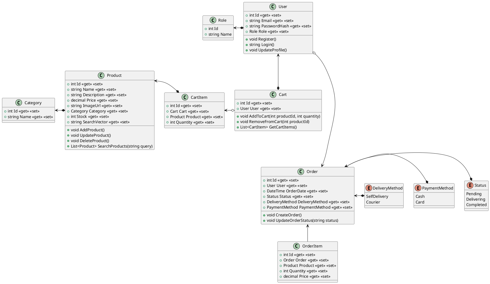

```plantuml
@startuml
top to bottom direction

class Role {
  +int Id
  +string Name
}

Role <-* User
class User {
  +int Id <<get>> <<set>>
  +string Email <<get>> <<set>>
  +string PasswordHash <<get>> <<set>>
  +Role Role <<get>> <<set>>
  +void Register()
  +string Login()
  +void UpdateProfile()
}

User -[hidden]-> Category 
class Category {
  +int Id <<get>> <<set>>
  +string Name <<get>> <<set>>
}

Category <-* Product
class Product {
  +int Id <<get>> <<set>>
  +string Name <<get>> <<set>>
  +string Description <<get>> <<set>>
  +decimal Price <<get>> <<set>>
  +string ImageUrl <<get>> <<set>>
  +Category Category <<get>> <<set>>
  +int Stock <<get>> <<set>>
  +string SearchVector <<get>> <<set>>
  +void AddProduct()
  +void UpdateProduct()
  +void DeleteProduct()
  +List<Product> SearchProducts(string query)
}

Product -[hidden]-> CartItem
Product <-* CartItem
class CartItem {
  +int Id <<get>> <<set>>
  +Cart Cart <<get>> <<set>>
  +Product Product <<get>> <<set>>
  +int Quantity <<get>> <<set>>
}

User <-* Cart
CartItem <-o Cart
class Cart {
  +int Id <<get>> <<set>>
  +User User <<get>> <<set>>
  +void AddToCart(int productId, int quantity)
  +void RemoveFromCart(int productId)
  +List<CartItem> GetCartItems()
}

Cart -[hidden]-> Order
enum Status {
  Pending
  Delivering
  Completed
}

enum PaymentMethod {
  Cash
  Card
}

enum DeliveryMethod {
  SelfDelivery
  Courier
}

Order <-* Status
Order <-* PaymentMethod
Order <-* DeliveryMethod
Order <-o User
class Order {
  +int Id <<get>> <<set>>
  +User User <<get>> <<set>>
  +DateTime OrderDate <<get>> <<set>>
  +Status Status <<get>> <<set>>
  +DeliveryMethod DeliveryMethod <<get>> <<set>>
  +PaymentMethod PaymentMethod <<get>> <<set>>
  +void CreateOrder()
  +void UpdateOrderStatus(string status)
}

Order <-- OrderItem
class OrderItem {
  +int Id <<get>> <<set>>
  +Order Order <<get>> <<set>>
  +Product Product <<get>> <<set>>
  +int Quantity <<get>> <<set>>
  +decimal Price <<get>> <<set>>
}

@enduml
```

