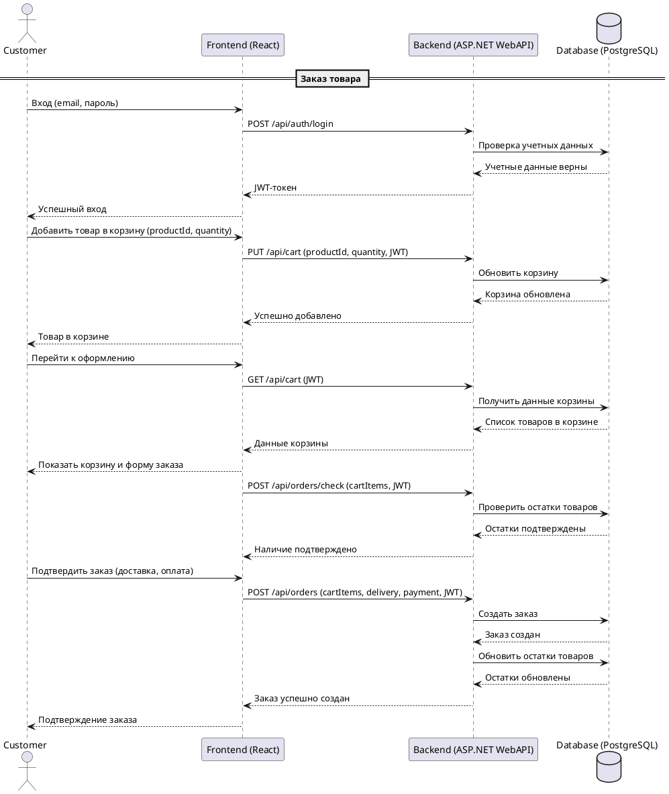
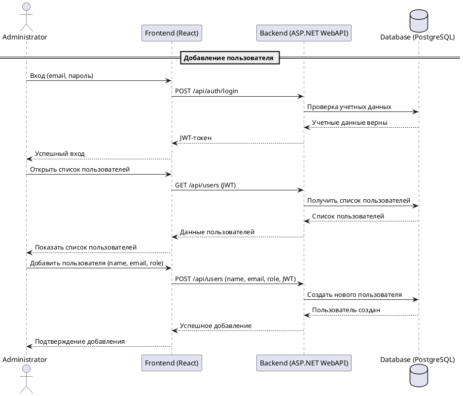
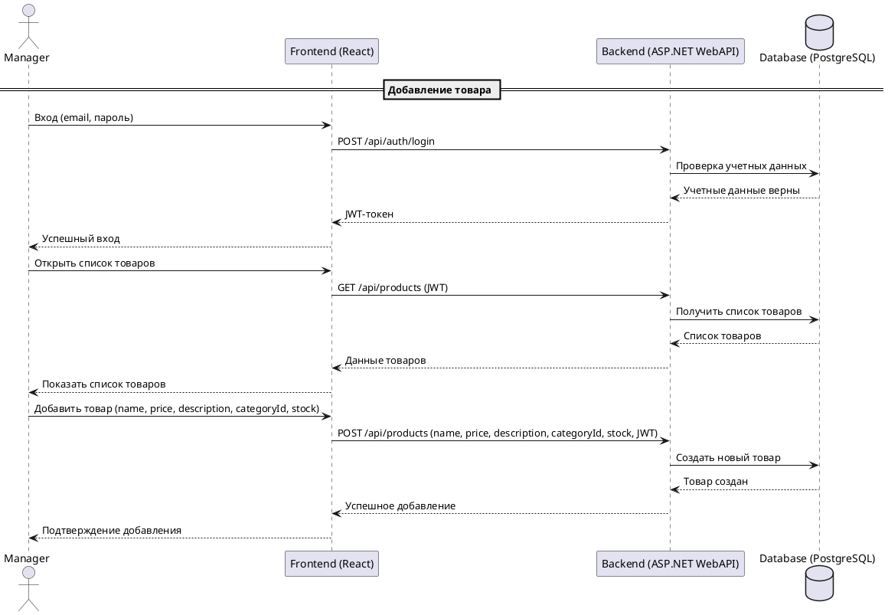

### Заказ товара (пользователь)

```plantuml
@startuml
actor Customer
participant "Frontend (React)" as Frontend
participant "Backend (ASP.NET WebAPI)" as Backend
database "Database (PostgreSQL)" as Database

== Заказ товара ==

' Авторизация
Customer -> Frontend: Вход (email, пароль)
Frontend -> Backend: POST /api/auth/login
Backend -> Database: Проверка учетных данных
Database --> Backend: Учетные данные верны
Backend --> Frontend: JWT-токен
Frontend --> Customer: Успешный вход

' Добавление товара в корзину
Customer -> Frontend: Добавить товар в корзину (productId, quantity)
Frontend -> Backend: PUT /api/cart (productId, quantity, JWT)
Backend -> Database: Обновить корзину
Database --> Backend: Корзина обновлена
Backend --> Frontend: Успешно добавлено
Frontend --> Customer: Товар в корзине

' Переход к оформлению заказа
Customer -> Frontend: Перейти к оформлению
Frontend -> Backend: GET /api/cart (JWT)
Backend -> Database: Получить данные корзины
Database --> Backend: Список товаров в корзине
Backend --> Frontend: Данные корзины
Frontend --> Customer: Показать корзину и форму заказа

' Проверка наличия товаров
Frontend -> Backend: POST /api/orders/check (cartItems, JWT)
Backend -> Database: Проверить остатки товаров
Database --> Backend: Остатки подтверждены
Backend --> Frontend: Наличие подтверждено

' Подтверждение заказа
Customer -> Frontend: Подтвердить заказ (доставка, оплата)
Frontend -> Backend: POST /api/orders (cartItems, delivery, payment, JWT)
Backend -> Database: Создать заказ
Database --> Backend: Заказ создан
Backend -> Database: Обновить остатки товаров
Database --> Backend: Остатки обновлены
Backend --> Frontend: Заказ успешно создан
Frontend --> Customer: Подтверждение заказа

@enduml
```

### Добавление пользователя (администратор)

```plantuml
@startuml
actor Administrator
participant "Frontend (React)" as Frontend
participant "Backend (ASP.NET WebAPI)" as Backend
database "Database (PostgreSQL)" as Database

== Добавление пользователя ==

' Вход администратора
Administrator -> Frontend: Вход (email, пароль)
Frontend -> Backend: POST /api/auth/login
Backend -> Database: Проверка учетных данных
Database --> Backend: Учетные данные верны
Backend --> Frontend: JWT-токен
Frontend --> Administrator: Успешный вход

' Переход к управлению пользователями
Administrator -> Frontend: Открыть список пользователей
Frontend -> Backend: GET /api/users (JWT)
Backend -> Database: Получить список пользователей
Database --> Backend: Список пользователей
Backend --> Frontend: Данные пользователей
Frontend --> Administrator: Показать список пользователей

' Добавление нового пользователя
Administrator -> Frontend: Добавить пользователя (name, email, role)
Frontend -> Backend: POST /api/users (name, email, role, JWT)
Backend -> Database: Создать нового пользователя
Database --> Backend: Пользователь создан
Backend --> Frontend: Успешное добавление
Frontend --> Administrator: Подтверждение добавления

@enduml
```

### Добавление товара (менеджер)

```plantuml
@startuml
actor Manager
participant "Frontend (React)" as Frontend
participant "Backend (ASP.NET WebAPI)" as Backend
database "Database (PostgreSQL)" as Database

== Добавление товара ==

' Вход менеджера
Manager -> Frontend: Вход (email, пароль)
Frontend -> Backend: POST /api/auth/login
Backend -> Database: Проверка учетных данных
Database --> Backend: Учетные данные верны
Backend --> Frontend: JWT-токен
Frontend --> Manager: Успешный вход

' Переход к управлению товарами
Manager -> Frontend: Открыть список товаров
Frontend -> Backend: GET /api/products (JWT)
Backend -> Database: Получить список товаров
Database --> Backend: Список товаров
Backend --> Frontend: Данные товаров
Frontend --> Manager: Показать список товаров

' Добавление нового товара
Manager -> Frontend: Добавить товар (name, price, description, categoryId, stock)
Frontend -> Backend: POST /api/products (name, price, description, categoryId, stock, JWT)
Backend -> Database: Создать новый товар
Database --> Backend: Товар создан
Backend --> Frontend: Успешное добавление
Frontend --> Manager: Подтверждение добавления

@enduml
```
