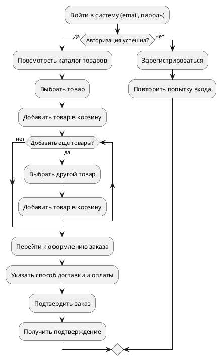
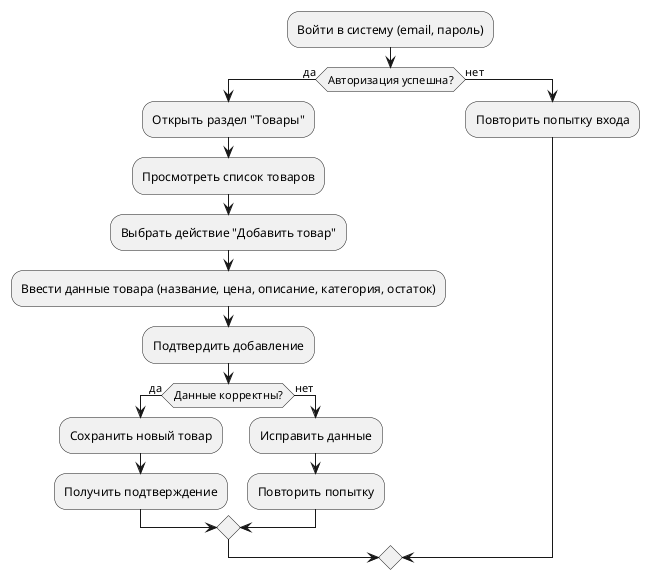
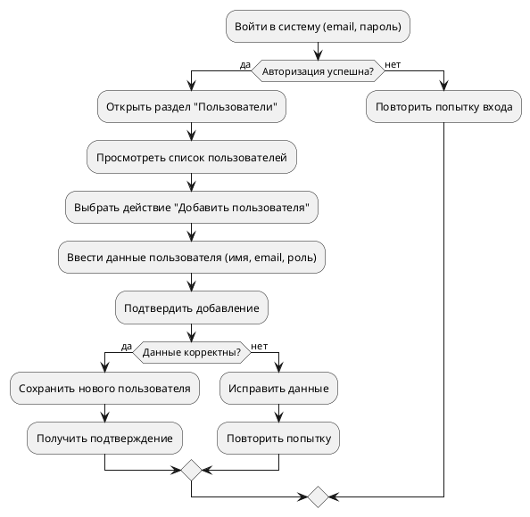

### Для пользователя

```plantuml
@startuml
|Покупатель|
:Войти в систему (email, пароль);
if (Авторизация успешна?) then (да)
  :Просмотреть каталог товаров;
  :Выбрать товар;
  :Добавить товар в корзину;
  while (Добавить ещё товары?) is (да)
    :Выбрать другой товар;
    :Добавить товар в корзину;
  endwhile (нет)
  :Перейти к оформлению заказа;
  :Указать способ доставки и оплаты;
  :Подтвердить заказ;
  :Получить подтверждение;
else (нет)
  :Зарегистрироваться;
  :Повторить попытку входа;
endif
|Покупатель|
@enduml
```

### Для менеджера

```plantuml
@startuml
|Менеджер|
:Войти в систему (email, пароль);
if (Авторизация успешна?) then (да)
  :Открыть раздел "Товары";
  :Просмотреть список товаров;
  :Выбрать действие "Добавить товар";
  :Ввести данные товара (название, цена, описание, категория, остаток);
  :Подтвердить добавление;
  if (Данные корректны?) then (да)
    :Сохранить новый товар;
    :Получить подтверждение;
  else (нет)
    :Исправить данные;
    :Повторить попытку;
  endif
else (нет)
  :Повторить попытку входа;
endif
|Менеджер|
@enduml
```

### Для администратора

```plantuml
@startuml
|Администратор|
:Войти в систему (email, пароль);
if (Авторизация успешна?) then (да)
  :Открыть раздел "Пользователи";
  :Просмотреть список пользователей;
  :Выбрать действие "Добавить пользователя";
  :Ввести данные пользователя (имя, email, роль);
  :Подтвердить добавление;
  if (Данные корректны?) then (да)
    :Сохранить нового пользователя;
    :Получить подтверждение;
  else (нет)
    :Исправить данные;
    :Повторить попытку;
  endif
else (нет)
  :Повторить попытку входа;
endif
|Администратор|
@enduml
```
