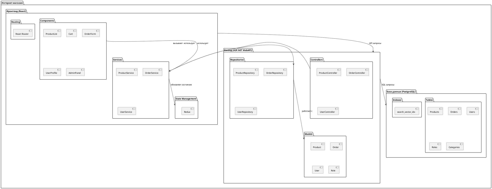

```plantuml-svg
@startuml
package "Интернет-магазин" {
    package "Фронтенд (React)" {
        package "Components" {
            [ProductList]
            [Cart]
            [OrderForm]
            [UserProfile]
            [AdminPanel]
        }
        package "Services" {
            [ProductService]
            [OrderService]
            [UserService]
        }
        package "State Management" {
            [Redux]
        }
        package "Routing" {
            [React Router]
        }
    }

    package "Бэкенд (ASP.NET WebAPI)" {
        package "Controllers" {
            [ProductController]
            [OrderController]
            [UserController]
        }
        package "Services" {
            [ProductService]
            [OrderService]
            [UserService]
        }
        package "Repositories" {
            [ProductRepository]
            [OrderRepository]
            [UserRepository]
        }
        package "Models" {
            [Product]
            [Order]
            [User]
            [Role]
        }
    }

    package "База данных (PostgreSQL)" {
        package "Tables" {
            [Products]
            [Orders]
            [Users]
            [Roles]
            [Categories]
        }
        package "Indexes" {
            [search_vector_idx]
        }
    }

    ' Внешние связи
    "Фронтенд (React)" --> "Бэкенд (ASP.NET WebAPI)" : API запросы
    "Бэкенд (ASP.NET WebAPI)" --> "База данных (PostgreSQL)" : SQL запросы

    ' Внутренние связи фронтенда
    "Components" --> "Services" : использует
    "Services" --> "State Management" : обновляет состояние

    ' Внутренние связи бэкенда
    "Controllers" --> "Services" : вызывает
    "Services" --> "Repositories" : использует
    "Repositories" --> "Models" : работает с
}
@enduml
```

